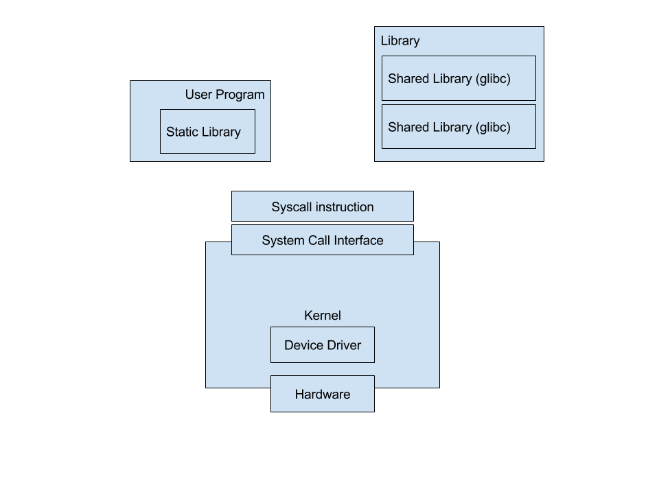

===================
System Architecture
===================

Introduction
============

In this chapter we will see some of the very basic concepts of the operating systems and programs which run on it.

#.  What is a computer program, how to convert the ``.c`` file to an ``executable`` and what are the steps involved.
#.  What are libraries and see learn shared libraries as well as static libraries.
#.  What are system calls?
#.  What is a kernel?
#.  How the block diagram looks like?

What is a program?
==================

For running a program on a Linux System these are the steps involved.

#.  Write the program.
#.  Compile and make an executable of that program using a compiler. For C programs we use ``gcc``.
#.  Run the program on the system.

These steps are pretty simple and straight forward but there is a lot of things which go under the hood and is hidden under the following tools.

Introduction
============

- ``gcc`` has to undergo a lot of stages while compiling your code. The sequence is ``PREPROCESSING -> ASSEMBLING -> COMPILATION - LINKING``

Preprocessing
=============

#.  This stage converts the macros in the c file to c code which can be compiled. See the file ``hello.e``. Here the macro ``#include`` has been expanded and the whole file ``stdio.h`` has been copied in the c file.

Compilation
===========

#.  Here the assembled code will be converted into the opcode of the assembly instruction.

Assembling
==========

#.  This stage will convert the C programming language into the instruction set of the CPU. See the file ``hello.s``. Here you will only see assembly instructions.

Linking
=======

#.  Here the code will be linked with the libraries present on the system. Note that ``printf`` function is not defined in your code, neither it is defined in the file ``stdio.h``. It is just declared in the header file and it is stored in the compiled and executable format in a shared library on the system.

Hands-On
========

- Write the code

::
    
    #include <stdio.h>
    int main() {
        printf("\nHello World");
        return 0;
    }

- Pre-process the file

    ``gcc -E hello_world.c > temp.c``

- Read the ``temp.c`` file to understand what has been done in the pre-processing stage.

- Assemble the ``temp.c`` file

    ``gcc -S temp.c`` - you will get a file ``temp.s`` - Read the file to see the assembled code

- Compile the ``temp.s`` file

    ``gcc -c temp.s`` - you will get a file ``temp.o`` - Read the file with ``objdump -D temp.o`` - You will get to see the full contents of the file

Link the file

- Now this is a bit tricky as calling ``ld`` with the right option will be required. We will see how ``gcc`` does it.

Run ``gcc hello_world.c -v`` to see what ``gcc`` does

- ``/usr/lib/gcc/x86_64-linux-gnu/4.7/collect2 --sysroot=/ --build-id --no-add-needed --as-needed --eh-frame-hdr -m elf_x86_64 --hash-style=gnu -dynamic-linker /lib64/ld-linux-x86-64.so.2 -z relro /usr/lib/gcc/x86_64-linux-gnu/4.7/../../../x86_64-linux-gnu/crt1.o /usr/lib/gcc/x86_64-linux-gnu/4.7/../../../x86_64-linux-gnu/crti.o /usr/lib/gcc/x86_64-linux-gnu/4.7/crtbegin.o -L/usr/lib/gcc/x86_64-linux-gnu/4.7 -L/usr/lib/gcc/x86_64-linux-gnu/4.7/../../../x86_64-linux-gnu -L/usr/lib/gcc/x86_64-linux-gnu/4.7/../../../../lib -L/lib/x86_64-linux-gnu -L/lib/../lib -L/usr/lib/x86_64-linux-gnu -L/usr/lib/../lib -L/usr/lib/gcc/x86_64-linux-gnu/4.7/../../.. /tmp/ccJtDOL4.o -lgcc --as-needed -lgcc_s --no-as-needed -lc -lgcc --as-needed -lgcc_s --no-as-needed /usr/lib/gcc/x86_64-linux-gnu/4.7/crtend.o /usr/lib/gcc/x86_64-linux-gnu/4.7/../../../x86_64-linux-gnu/crtn.o``

- You will get something like above, this is the exact step done during the linking step. ``gcc`` internally call it for linking. Read more about it http://gcc.gnu.org/onlinedocs/gccint/Collect2.html

- The difference is marked with ``>>>>> <<<<<``

- ``/usr/lib/gcc/x86_64-linux-gnu/4.7/collect2 --sysroot=/ --build-id --no-add-needed --as-needed --eh-frame-hdr -m elf_x86_64 --hash-style=gnu -dynamic-linker /lib64/ld-linux-x86-64.so.2 -z relro /usr/lib/gcc/x86_64-linux-gnu/4.7/../../../x86_64-linux-gnu/crt1.o /usr/lib/gcc/x86_64-linux-gnu/4.7/../../../x86_64-linux-gnu/crti.o /usr/lib/gcc/x86_64-linux-gnu/4.7/crtbegin.o -L/usr/lib/gcc/x86_64-linux-gnu/4.7 -L/usr/lib/gcc/x86_64-linux-gnu/4.7/../../../x86_64-linux-gnu -L/usr/lib/gcc/x86_64-linux-gnu/4.7/../../../../lib -L/lib/x86_64-linux-gnu -L/lib/../lib -L/usr/lib/x86_64-linux-gnu -L/usr/lib/../lib >>>>>>>>> -L/usr/lib/gcc/x86_64-linux-gnu/4.7/../../.. /tmp/ccJtDOL4.o <<<<<<<<<<<<<<< -lgcc --as-needed -lgcc_s --no-as-needed -lc -lgcc --as-needed -lgcc_s --no-as-needed /usr/lib/gcc/x86_64-linux-gnu/4.7/crtend.o /usr/lib/gcc/x86_64-linux-gnu/4.7/../../../x86_64-linux-gnu/crtn.o``

- ``/usr/lib/gcc/x86_64-linux-gnu/4.7/collect2 --sysroot=/ --build-id --no-add-needed --as-needed --eh-frame-hdr -m elf_x86_64 --hash-style=gnu -dynamic-linker /lib64/ld-linux-x86-64.so.2 -z relro /usr/lib/gcc/x86_64-linux-gnu/4.7/../../../x86_64-linux-gnu/crt1.o /usr/lib/gcc/x86_64-linux-gnu/4.7/../../../x86_64-linux-gnu/crti.o /usr/lib/gcc/x86_64-linux-gnu/4.7/crtbegin.o -L/usr/lib/gcc/x86_64-linux-gnu/4.7 -L/usr/lib/gcc/x86_64-linux-gnu/4.7/../../../x86_64-linux-gnu -L/usr/lib/gcc/x86_64-linux-gnu/4.7/../../../../lib -L/lib/x86_64-linux-gnu -L/lib/../lib -L/usr/lib/x86_64-linux-gnu >>>>>>>>>>>>>temp.o<<<<<<<<<<<<<< -lgcc --as-needed -lgcc_s --no-as-needed -lc -lgcc --as-needed -lgcc_s --no-as-needed /usr/lib/gcc/x86_64-linux-gnu/4.7/crtend.o /usr/lib/gcc/x86_64-linux-gnu/4.7/../../../x86_64-linux-gnu/crtn.o``

- Run the command with the  replaced the object file in the above

- ``/usr/lib/gcc/x86_64-linux-gnu/4.7/collect2 --sysroot=/ --build-id --no-add-needed --as-needed --eh-frame-hdr -m elf_x86_64 --hash-style=gnu -dynamic-linker /lib64/ld-linux-x86-64.so.2 -z relro /usr/lib/gcc/x86_64-linux-gnu/4.7/../../../x86_64-linux-gnu/crt1.o /usr/lib/gcc/x86_64-linux-gnu/4.7/../../../x86_64-linux-gnu/crti.o /usr/lib/gcc/x86_64-linux-gnu/4.7/crtbegin.o -L/usr/lib/gcc/x86_64-linux-gnu/4.7 -L/usr/lib/gcc/x86_64-linux-gnu/4.7/../../../x86_64-linux-gnu -L/usr/lib/gcc/x86_64-linux-gnu/4.7/../../../../lib -L/lib/x86_64-linux-gnu -L/lib/../lib -L/usr/lib/x86_64-linux-gnu temp.o -lgcc --as-needed -lgcc_s --no-as-needed -lc -lgcc --as-needed -lgcc_s --no-as-needed /usr/lib/gcc/x86_64-linux-gnu/4.7/crtend.o /usr/lib/gcc/x86_64-linux-gnu/4.7/../../../x86_64-linux-gnu/crtn.o``

- You will get your ``a.out`` file

- Run it ``./a.out``

::

    Hello World

#.  Compiler
#.  Linker
#.  Loader.

Let me elaborate the above steps with respect to a C program. Following is the C program which we will take for consideration, ``prog1.c``.

::
    
    #include <stdio.h>

    int main() {
        printf("%s", "Hello World");
        return 0;
    }
    

#.  Write the program.
#.  Pre-process the program. Run ``gcc -E hello.c > hello.e``.
#.  Assemble the pre-processed code. Run ``gcc -S pprog1.e``. You will get a file ``pprog1.s``
#.  Compile the assembled code. Run ``gcc -c pprog1.s``. You will get a file ``pprog1.s``.
#.  Run the linker on the compiled code. ``gcc pprog1.o``. You will get a file with name as ``a.out``.

Now let us see the above stages in a bit detail.

Libraries
=========

A library is a zipped file of compiled code. The code is compiled and kept in a
format that any other program can use the code by just linking to it. For the
this the program should just have the function declared in the code so that the
compilation stage knows that the function's code will be linked to at a ``later
stage.``

In the linking phase the linker links the code by ``attaching`` the function
call's code present in the library to the function place where function is
called in the compiled code.

There are two words which I have ``italicized`` in the above paragraph
``attaching`` and ``later stage``.

An executable is said to be **staticically linked** if the ``later stage`` is
the last stage of the compilation and ``attaching`` is done in the last stage
of installation.

An executable is said to be **dynamically linked** if the ``later stage`` is at
the time of program execution and attaching is also done at the time of program
execution. This is the role of ``loader``.

Static Library
==============

In the above section we have understood that we can compile some code and keep
it as a library on the system, then use the code to ``link`` (read as
``attaching``) to some new programs. When we ``link``  the code at the compile
time we call it a statically compiled executable. This increases the size of
the executable program as the whole library gets copied to the executable. This
has the benefit that the executable becomes self sufficient and can execute on
any other Linux machine.

Shared Library
==============

If the compiled library is not linked but not attached to the executable at the
time of execution then it is called a dynamically linked executable. This is
achieved by just storing the location of the function's address in the library.
The executable expects the library to be present on the system where it will be
executed. This is one downside of dynamic linking, where as the advantage is
that the new executable will have a smaller size.

This is very useful for the libraries which are used by a lot of executable
like ``glibc``.

See this 

::

    bin/ls: ELF 64-bit LSB executable, x86-64, version 1 (SYSV), dynamically linked, interpreter /lib64/ld-linux-x86-64.so.2, for GNU/Linux 2.6.32, BuildID[sha1]=eca98eeadafddff44caf37ae3d4b227132861218, stripped

System Calls
============

System calls are API's which the Kernel Provides to the user space
applications. The system calls pass some arguments to the kernel space and the
kernel acts accordingly on the arguments

For example: ``open()`` system call - opens a file so that further read and
write operations can be done on the file. The return value of the ``open``
system call is a ``file descriptor`` or an ``error status``. Successful return value
allows the user space applications to use the ``file descriptor`` for further reads
and writes.

System calls get executed in the kernel space. Kernel space runs in an elevated
privileged mode. There is a shift of the privileged modes whenever a system call
is called and hence its a bad idea to call system calls without considering the
time taken to switch to the elevated privileged mode.

For example - lets say that you want to copy a file. One way of copying the file
is to read each character of the file and for every character read you write the
character to another file. This will call two system calls for every
character you read and write. As this is expensive in terms of time its a bad
design.

Let us see a small demonstration of this.

.. literalinclude:: code_system_calls/00/slow_write.c
    :language: c
    :linenos:

What should instead be done here is that you read a block (set of characters)
and then write that block into another file. This will reduce the number of the
system calls and thus increase the overall performance of the file copy
program.

.. literalinclude:: code_system_calls/00/fast_write.c
    :language: c
    :linenos:

.. literalinclude:: code_system_calls/00/Makefile
    :language: make
    :linenos:

Kernel
======

Kernel is an important component of any Operating System. This is the only
layer which interacts directly with the hardware. So in order to get any work
done from your hardware you need to ``ask`` the kernel to do this.

This ``asking`` is done by ``system calls``. When you call any system call a
function in the kernel is invoked and it gets the work done. The arguments we
passed are passed to the kernel and a particular function call is invoked.

For the functions any hardware interaction is needed the kernel interacts with
the hardware through the device driver of the hardware.

System Architecture
===================

With the above context about important components of the system we can now draw the following diagram.

    This is the caption of the figure (a simple paragraph).

References
==========
